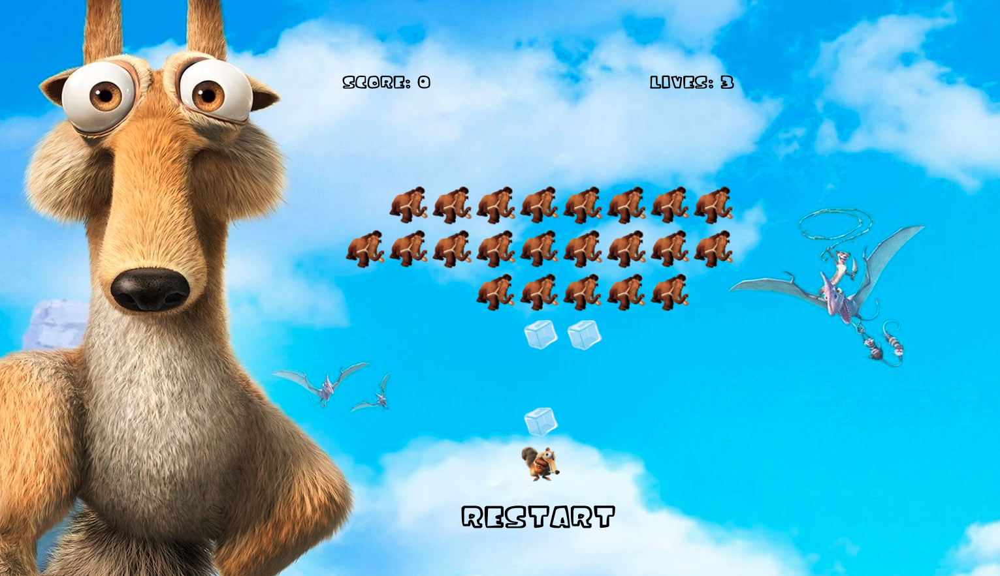

###  General Assembly, Software Engineering Immersive

# Ice Age Wars 

# Project-1

## Overview

Space Invaders/Ice Age Wars is my first ever front-end development project, produced as part of General Assembly's Immersive Software Engineering Bootcamp.

My task was to create a grid-based game rendered in the browser that utilised Vanilla JavaScript, HTML and CSS.

Given a selection of classic arcade games to choose from, I opted to build my take on _Space Invaders_. The theme was inspired by the _Ice Age_ movie.

The project was mainly to consolidate my beginners' knowledge of JavaScript and interacting with the DOM, but I worked hard to make it a fun experience to play.

It was an independent project built in a week and is both the first real game I have built and the first instance applying real-world-type logic with Vanilla JavaScript.

You can play the game [here](https://d-tsonev.github.io/Project-1/)

## The Brief

- **Render a game in the browser**.
- **Design logic for winning & visually display which player won**.
- **Include separate HTML / CSS / JavaScript files**.
- Stick with **KISS (Keep It Simple Stupid)** and **DRY (Don't Repeat Yourself)** principles.
- Use **Javascript** for **DOM manipulation**.
- **Deploy your game online**, where the rest of the world can access it.
- Use **semantic markup** for HTML and CSS (adhere to best practices).

## The Technologies used

- **HTML5**
- **CSS3**
- **JavaScript (ES6)**
- **Git and GitHub**
- **Google Fonts**
- **Photoshop**
- **GarageBand**


<p>Link to <a href="https://d-tsonev.github.io/Project-1/">Ice Age Wars</a> is here<p>

And a live demo of me playing badly :

)


<h2>Introduction</h2>

The game’s aim has remained the same: for the user to shoot the invading mammoths armada before it reaches dangerously close to the player.

As the Mammoths fleet don't come in peace and periodically drops ice bocks towards the Player.

The player must dodge these ice blocks hurtling towards them by moving from left to right.

The squirrel can use his hammer to throw acorns if the user presses the up arrow key to shoot at the approaching Mammoths.

The player wins by destroying the Mammoths armada. The player has three lives and loses a life each time the player is hit by one of the ice blocks dropped by the Mammoths armada.

Once the player has won or died, the player can choose to play again.

The game aims is to achieve the highest score before the Mammoths reach the spaceship.

## The Approach

### The Grid

The game is built using a grid 9 x 9 square, which is created using JavaScript. HTML divs are created using a for loop and appended as children of the grid.

```js
const width = 9;
const height = 9;
const cells = [];
let playerPosition = 76;
const grid = document.querySelector(".grid");
// Grid
for (let i = 0; i < width ** 2; i++) {
  const div = document.createElement("div");
  grid.appendChild(div);
  div.style.width = `${100 / width}%`;
  div.style.height = `${100 / width}%`;
  div.classList.add("cells");
  cells.push(div);
}
```

### Opponent Movement

Enemy ships are defined as an array of numbers which correspond to their position on the grid:

<code>
let aliensPosition = [9, 10, 11, 12, 13, 14, 15, 16, 17, 18, 19, 20, 21, 22, 23, 24, 25, 29, 30, 31, 32, 33]
</code>

They are then added to the grid using a forEach statement.

```js
aliensPosition.forEach((indexNumber) => {
  cells[indexNumber].classList.add("alien");
});
```

Using a `setInterval` function, the Mammoths will move one space to the right using 'for each' I removed the class of 'alien'(Mammoths) from the cells and then I mapped the array to reasign new alien position adding the class again for each alien in position +1 . If the arrays of aline reach the bottom row (where the player is positioned) then the player loses the game.

```js

function movingAliens() {
  const intervalAliens = setInterval(() => {
    cells.forEach((indexNumber) => {
      indexNumber.classList.remove("alien");
    });
    aliensPosition = aliensPosition.map((alien) => alien + 1);
    aliensPosition.forEach((newIndex) => {
      cells[newIndex].classList.add("alien");
    });
    if (aliensPosition.some((alien) => alien > 71)) {
      clearInterval(intervalAliens);
      lives.innerHTML = "Game Over";
      gameOver.innerHTML = "Game Over";
    }
    if (game === false) {
      clearInterval(intervalAliens);
    }
  }, 450);
}

```

### Opponent throwing bombs

Mammoths are dropping ice cubes every 1000 milliseconds using a setInterval. The firing position is randomly determined using `Math.random` based on the position of the Mammoths that are furthest forward.
If a bomb hits the player then he loses a life.

Below, a `setInterval` is declared. It contains a variable that finds the front Mamuths of my array of mammoths.

The `ice` CSS class is added to the cell in front of the random Mammoths, a sound plays and another setInterval is declared that adds and removes the CSS class until there is a collision with the player or the enemy laser reaches the end of the grid. If the enemy laser collides with the player, the player is replaced by a smash CSS class and the player loses one of his 3 lives, then the player is positioned where he starts, in the middle.

```js

function bombs() {
  const radnomIndex = Math.floor(Math.random() * aliensPosition.length);
  const randomAliensPosition = aliensPosition[radnomIndex];
  let randomAliensPosition2 = randomAliensPosition + height;
  if (cells[randomAliensPosition2].classList.contains("alien")) {
    randomAliensPosition2 += height;
  }
  const intervalIdIce = setInterval(() => {
    if (randomAliensPosition2 < width ** 2) {
      cells[randomAliensPosition2].classList.remove("ice");
      randomAliensPosition2 += height;
      if (randomAliensPosition2 <= width ** 2 - height) {
        cells[randomAliensPosition2].classList.add("ice");
      }
      if (cells[randomAliensPosition2].classList.contains("player")) {
        audioPlayer.src = "./sounds/smash.wav";
        audioPlayer.volume = 0.3;
        audioPlayer.play();
        cells[randomAliensPosition2].classList.add("smash");
        cells[randomAliensPosition2].classList.remove("player");

        setTimeout(() => {
          cells[randomAliensPosition2].classList.remove("smash");
        }, 800);
        currentLives -= 1;
        playerPosition = 79;
        cells[playerPosition].classList.add("player");
        lives.innerHTML = `Lives: ${currentLives}`;
        if (currentLives === 0) {
          clearInterval(intervalIdIce);
          clearInterval(intervalbombs);
          lives.innerHTML = "Game Over";
          gameOver.innerHTML = "Game Over";
          game = false;
        }
      }
    } else {
      console.log("line70");
      clearInterval(intervalIdIce);
    }
  }, 1000);
}
// Alians shooting
const intervalbombs = setInterval(() => {
  bombs();
}, 1000);

```

### The Player

The player is a variable defined with a number, which defines its position on the grid:

```js
let playerPosition = 76;
```

Moving the player comes from an event listener that checks for a `keydown` event on the user's keyboard. I then defined a if statement that established whether the player would move left, right or fire acorns.

```js
document.addEventListener("keydown", (e) => {
  const key = e.key;
  if (key === "ArrowUp") {
    audioPlayer.src = "./sounds/acons.wav";
    audioPlayer.play();
    shootingAcorns();
  } else if (key === "ArrowRight" && playerPosition !== width ** 2 - 1) {
    audioPlayer.src = "./sounds/walk.wav";
    audioPlayer.play();
    cells[playerPosition].classList.remove("player");
    playerPosition += 1;
    cells[playerPosition].classList.add("player");
  } else if (key === "ArrowLeft" && playerPosition !== width ** 2 - height) {
    audioPlayer.src = "./sounds/walk.wav";
    audioPlayer.play();
    cells[playerPosition].classList.remove("player");
    playerPosition -= 1;
    cells[playerPosition].classList.add("player");
  }
});
```

When the up arrow is called, the player shoots acorns. A variable is assigned to the position that is one space in front of the player on the grid alongside an associated CSS class. This includes a sound playing and the `'acorn'` CSS class being moved up the length of the grid, concurrent with the position of the `acorn` variable. This also includes logic for removing the acorn and Mammoths  whilst increasing the score.

```js

// Player shooting
  function shootingAcorns() {

    let aconPosition = playerPosition
    const intervalIdAcorn = setInterval(() => {
      console.log(cells[aconPosition].classList)
      if (aconPosition >= width && !cells[aconPosition].classList.contains('alien') && !cells[aconPosition].classList.contains('ice')) {
        console.log('clearinterval')
        cells[aconPosition].classList.remove('acorn')
        aconPosition -= width
        cells[aconPosition].classList.add('acorn')
      } else if (aconPosition <= width) {
        clearInterval(intervalIdAcorn)
        cells[aconPosition].classList.remove('acorn')
      } else {
        cells[aconPosition].classList.remove('acorn')
        if (cells[aconPosition].classList.contains('ice')) {
          cells[aconPosition].classList.remove('ice')
        } else if (cells[aconPosition].classList.contains('alien')) {
          cells[aconPosition].classList.remove('alien')
          aliensPosition.splice(aliensPosition.indexOf(aconPosition), 1)
        }

        cells[aconPosition].classList.add('explosion')
        currentScore += 100
        console.log(currentScore)
        score.innerHTML = `Score: ${currentScore}`
        setTimeout(() => {
          cells[aconPosition].classList.remove('explosion')
        }, 100)

        clearInterval(intervalIdAcorn)
      }
    }, 30)

  }

}

```

<h1>The three main improvements I'd like to make are as follows:</h1>

-Adding a leaderboard using localStorage to keep a track of high scores.<br>
-Make the game responsive and fully functioning on mobile and tablet.<br>
-Make the game more enjoyable for users by adding different levels of difficulty. <br>

## Challenges

- This was my first front-end JavaScript project and assembling all of my knowledge on arrays, control flow, functions, timeouts and intervals and applying them to an entirely blank canvas for the first time was, without doubt, the biggest challenge faced. In places, the code is lengthy and a little unwieldy, but I have deliberately left much of it like this as a way of referencing my ability and understanding at the time of creation (the project was set with a one-week timeframe). I've progressed a lot since completing this project.
- Moving the Mammoths was the single biggest technical challenge. 

## Victories

- I found this project to be very helpful in developing my experience with problem-solving as I initially had trouble separating the idea of actually moving the grid cells and adding classes to them instead to give the appearance of movement. This solidified my understanding of Vanilla JavaScript and gave me a chance to grow confident in using methods and functions to manipulate the user's experience.

- I'm pleased with the look and feel of the game in terms of its appearance and the sounds and the satisfaction of removing Mammoths.

- The project helped to consolidate my knowledge of JavaScript, HTML and CSS and interacting with the DOM.

## Potential future features


- I'd be keen to make this game mobile-friendly. I treated the task as the first try-out of my JavaScript knowledge and so was more concerned with building something that worked on a screen with a keyboard. I'd need to reconsider how the player interacts with the game to make it suitable for smartphone or tablet use.


## Lessons learned

- Design mobile-first.
- Plan better. By the latter stage of the project, I was already feeling much more comfortable in implementing my ideas. The boss level worked exactly as I was expecting it to after I planned it out carefully. The previously created elements involved much more trial and error.


